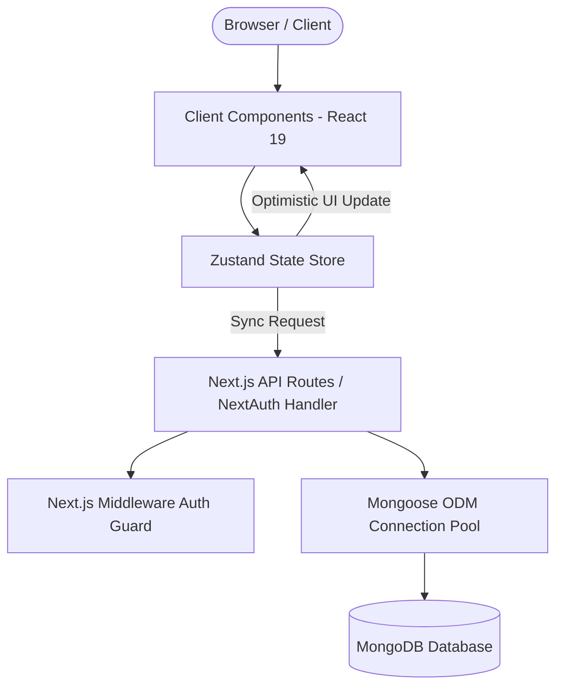
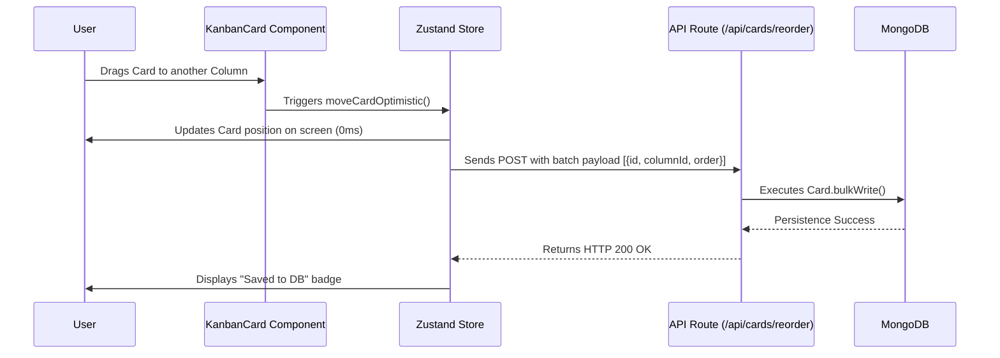

# 📐 System Architecture - Trilho

This document describes the software architecture, design patterns, and data flow of the **Trilho** application.

---

## 🏛️ Architecture Overview

Trilho was developed following the modern Fullstack paradigm promoted by **Next.js (App Router)**, combining server rendering for performance and reactive client components for rich Kanban interactions.

---

## 🧱 Core Architecture Components

### 1. Presentation Layer (UI)
- **App Router (`src/app`)**: Route organization using directory-based routing (`/board/[id]`, `/dashboard`, `/login`, `/register`).
- **Reusable Components (`src/components`)**:
  - `kanban/`: Render interactive columns, boards, and draggable cards.
  - `layout/`: Navbar with filter selectors, inline title editing, user profile, and collapsible Sidebar.
  - `modals/`: Modals for detailed card editing (with interactive checklists) and board creation.

### 2. State Management & Optimistic Updates (Zustand)
The active board state is held in client memory using **Zustand** (`src/store/useKanbanStore.ts`).

- **Optimistic Updates**: When a user drags a card across columns or reorders items:
  1. Zustand state updates **immediately** on screen.
  2. A background HTTP request is sent to the API (`/api/cards/reorder`).
  3. If the API returns an error, changes rollback to the previous state.
- **Save Status**: Visual indicator in the Navbar (`"Saving..."`, `"Saved to DB"`, `"Connection error"`).

### 3. Drag-and-Drop (`@hello-pangea/dnd`)
Uses `@hello-pangea/dnd` for smooth drag-and-drop card movements between droppable containers.

### 4. Fullstack Testing Infrastructure (Vitest + React Testing Library)
Integrated testing layer covering both client and server domains:
- **Client Side**: `vitest` + `@testing-library/react` + `jsdom` for testing React components and Zustand store logic.
- **Server Side**: `vitest` + Next.js App Router API route handlers (`/api/register`, `/api/boards`) and Mongoose schema models.
- For detailed testing architecture, see [`docs/TESTES.md`](TESTES.md).

---

## 🔄 Card Reordering Data Flow

---

## 🤖 AI Agent Memory System (Agent Context Memory Protocol)

The repository features a persistent context architecture for AI Agents (Claude, Antigravity, Codex, Cursor, etc.), defined in [`AGENTS.md`](AGENTS.md) and [`docs/memory/`](docs/memory/):

- **`AGENTS.md`**: Universal protocol read on session initialization by any AI agent.
- **`PROJECT_STATE.md`**: Repository state, dependencies, and module overview.
- **`CHANGELOG_MEMORY.md`**: Continuous log of commits, features, refactoring, and bug fixes.
- **`USER_DIRECTIVES.md`**: User preferences, product decisions, and extra-code context.
