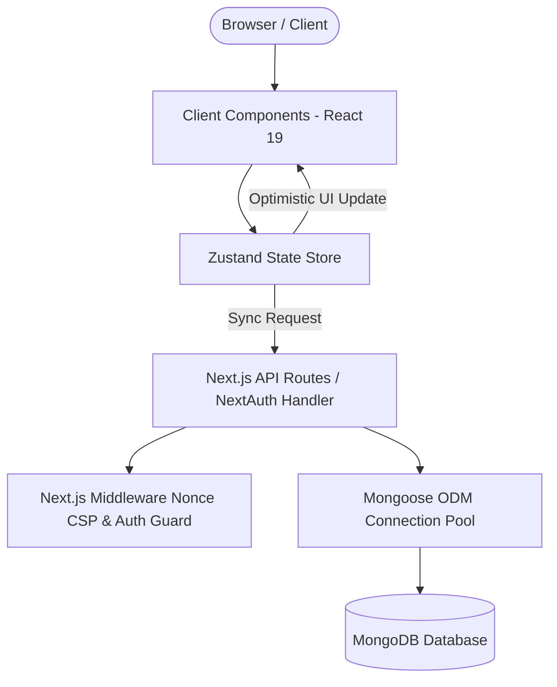
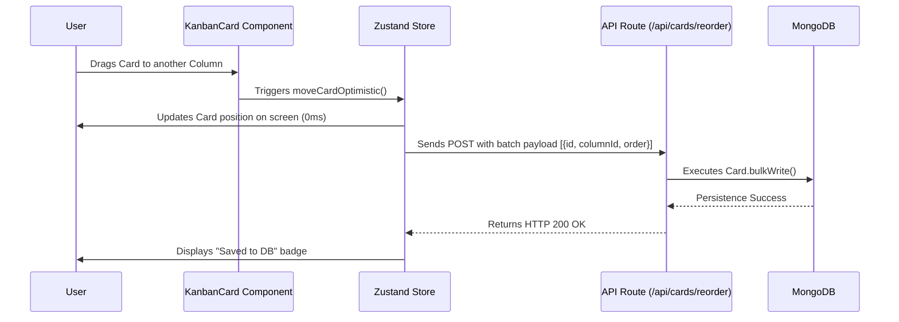

# 📐 System Architecture - Trilho

This document describes the software architecture, design patterns, and data flow of the **Trilho** application.

---

## 🏛️ Architecture Overview

Trilho was developed following the modern Fullstack paradigm promoted by **Next.js (App Router)**, combining server rendering for performance and reactive client components for rich Kanban interactions.

---

## 🧱 Core Architecture Components

### 1. Presentation Layer (UI)
- **App Router (`src/app`)**: Route organization using directory-based routing (`/board/[id]`, `/dashboard`, `/login`, `/register`, `/verify-email`, `/resend-verification`, `/forgot-password`, `/reset-password`).
- **Reusable Components (`src/components`)**:
  - `kanban/`: Render interactive columns, boards, custom field badges, and draggable cards.
  - `layout/`: Navbar with search/filter selectors, board title editing, save status pill, user profile modal, and off-canvas responsive Sidebar.
  - `modals/`: Modals for detailed card editing (with custom field value inputs and interactive checklists), board creation (`CreateBoardModal`), and board field definitions (`DefaultFieldsModal`).

### 2. State Management & Optimistic Updates (Zustand)
The active board state is held in client memory using **Zustand** (`src/store/useKanbanStore.ts`).

- **Optimistic Updates**: When a user drags a card between columns or reorders columns horizontally:
  1. Zustand state updates **immediately** on screen.
  2. A background HTTP request is sent to the API (`/api/cards/reorder` or `/api/columns/reorder`).
  3. If the API returns an error, changes rollback to the previous state.
- **Save Status**: Visual indicator in the Navbar and mobile floating status pill (`"Saving..."`, `"Saved to DB"`, `"Connection error"`).

### 3. Drag-and-Drop (`@hello-pangea/dnd`)
Uses `@hello-pangea/dnd` for vertical card reordering between columns and horizontal column reordering across the board canvas.

### 4. Content Security Policy & Security Headers (`src/middleware.ts`, `next.config.mjs`)
- **Strict Nonce CSP**: Dynamic per-request base64 Nonces injected on `script-src` and W3C CSP Level 3 `style-src-attr 'unsafe-inline'` / `style-src-elem 'self' 'unsafe-inline'` to protect against XSS while permitting Next.js framework runtime & drag-and-drop DOM mutations.
- **HTTP Security Headers**: Enforces `X-Frame-Options: DENY`, `X-Content-Type-Options: nosniff`, `Referrer-Policy: origin-when-cross-origin`, and `Permissions-Policy`.

### 5. Fullstack Testing Infrastructure (Vitest & Playwright E2E)
Integrated testing layer covering both unit and end-to-end testing domains:
- **Unit & Integration**: `vitest` + `@testing-library/react` + `jsdom` testing React components, Zustand store, Mongoose models, and API routes.
- **End-to-End (E2E)**: `@playwright/test` testing full user browser flows in chromium (`e2e/login.spec.ts`).
- For detailed testing architecture, see [`docs/TESTES.md`](TESTES.md).

---

## 🔄 Card Reordering Data Flow

---

## 🤖 AI Agent Memory System (Agent Context Memory Protocol)

The repository features a persistent context architecture for AI Agents (Claude, Antigravity, Codex, Cursor, etc.), defined in [`AGENTS.md`](AGENTS.md) and [`docs/memory/`](docs/memory/):

- **`AGENTS.md`**: Universal protocol read on session initialization by any AI agent.
- **`PROJECT_STATE.md`**: Repository state, dependencies, and module overview.
- **`CHANGELOG_MEMORY.md`**: Continuous log of commits, features, refactoring, and bug fixes.
- **`USER_DIRECTIVES.md`**: User preferences, product decisions, and extra-code context.

