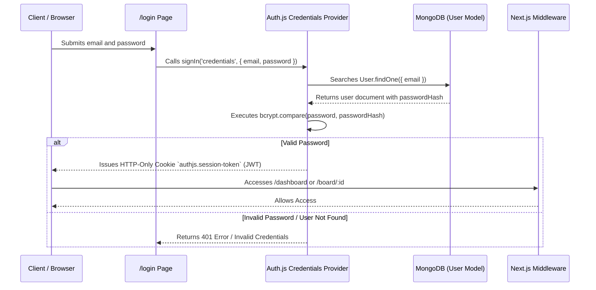

# 🔐 Authentication and Security - Trilho

This document specifies the security mechanisms, JWT session management, and access control in the **Trilho** application.

---

## 🛠️ Authentication Stack

- **Framework:** Auth.js v5 / NextAuth.js (`next-auth@beta`)
- **Session Strategy:** JWT (JSON Web Token) stateless sessions.
- **Provider:** `CredentialsProvider` (Email & Password).
- **Encryption:** `bcryptjs` for salted password hashing with cost 10.

---

## 🔄 Authentication Flow

---

## 🛡️ Route Guard Middleware (`src/middleware.ts`)

Private route protection is handled at the **Edge Middleware** level in Next.js before page rendering:

- **Protected Routes:** `/board/:path*`, `/dashboard/:path*`
- **Behavior:** If `authjs.session-token` cookie is missing, middleware intercepts the request and redirects to `/login?callbackUrl=...`.
- **Auth Routes (`/login`, `/register`):** If user is already authenticated, redirects automatically to `/dashboard`.
