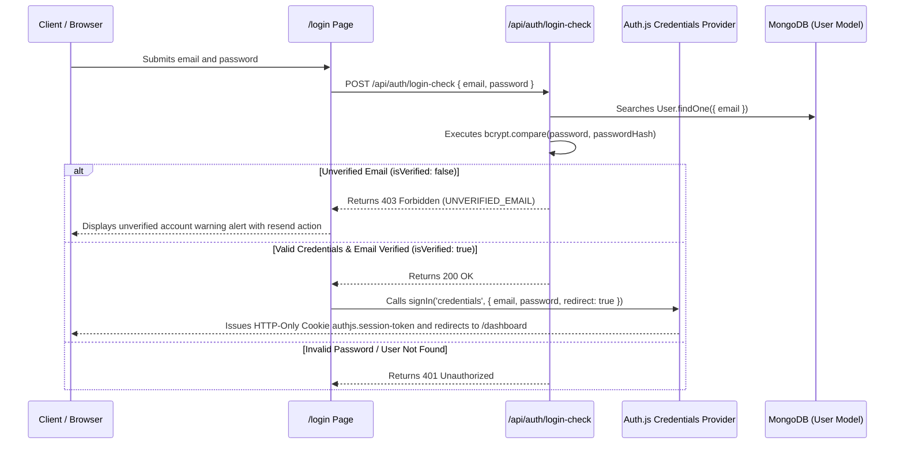

# 🔐 Authentication and Security - Trilho

This document specifies the security mechanisms, JWT session management, account email verification, password recovery, and access control in the **Trilho** application.

---

## 🛠️ Authentication Stack

- **Framework:** Auth.js v5 / NextAuth.js (`next-auth@beta`)
- **Session Strategy:** JWT (JSON Web Token) stateless sessions.
- **Provider:** `CredentialsProvider` (Email & Password).
- **Encryption:** `bcryptjs` for salted password hashing with cost 10.
- **Tokens & Signatures:** HMAC SHA256 base64url signed tokens for Email Verification (24h validity) and Password Reset (15m validity).
- **Rate Limiting:** In-memory IP rate limiter on sensitive auth endpoints (`src/lib/rateLimit.ts`).

---

## 🔄 Authentication & Verification Flow

---

## ✉️ Account Email Verification Workflow

1. **User Registration (`POST /api/register`)**: User account created with `isVerified: false`. A 24-hour signed HMAC SHA256 token is generated and emailed to the user via Resend API / SMTP (or logged in dev console).
2. **Account Activation (`GET /verify-email?token=...`)**: User clicks link to verify token and sets `isVerified: true`.
3. **Resend Verification Link (`/resend-verification`)**: Users can request a new 24h verification email if their token expires or is lost.

---

## 🔑 Password Recovery Workflow

1. **Forgot Password Request (`POST /api/auth/forgot-password`)**: User enters email address. If account exists, a 15-minute signed reset token is emailed to the user.
2. **Password Reset Page (`/reset-password?token=...`)**: User inputs new password. API validates token signature and 15-minute timestamp expiration before updating `passwordHash`.

---

## 🛡️ Route Guard Middleware & Security Headers (`src/middleware.ts`)

Private route protection and HTTP security policies are handled at the **Edge Middleware** level in Next.js before page rendering:

- **Protected Routes:** `/board/:path*`, `/dashboard/:path*`
- **Session Protection:** If `authjs.session-token` cookie is missing, middleware intercepts the request and redirects to `/login`.
- **Strict Nonce CSP Protection:** Dynamically generates a base64 Nonce per request, injecting `script-src 'self' 'nonce-${nonce}'` and W3C CSP Level 3 `style-src-attr 'unsafe-inline'` / `style-src-elem 'self' 'unsafe-inline'`.
- **HTTP Security Headers:** Enforces `X-Frame-Options: DENY`, `X-Content-Type-Options: nosniff`, `Referrer-Policy: origin-when-cross-origin`, and `Permissions-Policy`.

