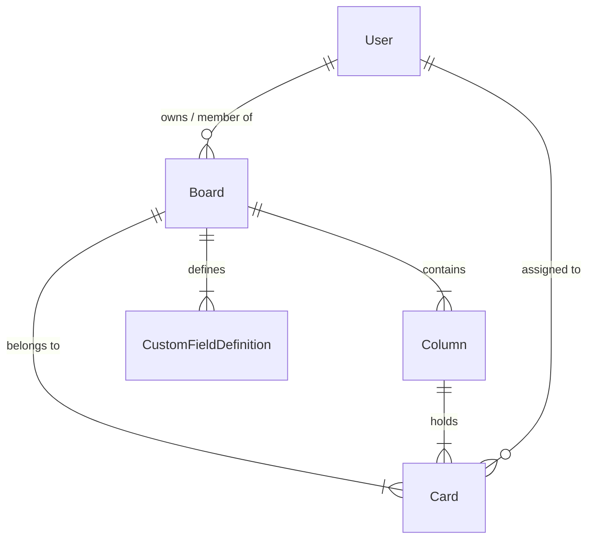

# 🗄️ NoSQL Database Model - Trilho

This document details the **MongoDB** Schemas and **Mongoose ODM** models used in **Trilho**.

---

## 🗂️ MongoDB Collections

The database consists of 5 main collections interconnected via ObjectIDs:



---

## 📐 Schemas and Document Structure

### 1. `User` Collection
Stores user credentials, account verification flags, and profiles.

```typescript
export interface IUser extends Document {
  _id: mongoose.Types.ObjectId;
  name: string;
  email: string;
  passwordHash: string;
  avatarUrl?: string;
  isVerified: boolean;
  createdAt: Date;
}
```

| Field | Type | Description |
| :--- | :--- | :--- |
| `_id` | ObjectId | Unique user identifier |
| `name` | String | Full name |
| `email` | String | Unique email (lowercase, indexed) |
| `passwordHash` | String | Salted password hash via `bcryptjs` |
| `avatarUrl` | String | Avatar image URL |
| `isVerified` | Boolean | Email verification status flag (default `false`) |
| `createdAt` | Date | Creation date |

---

### 2. `Board` Collection
Represents Kanban boards, owner authorization, team members, and pending invitations.

```typescript
export interface IBoardInvitation {
  _id: mongoose.Types.ObjectId;
  email: string;
  invitedBy: mongoose.Types.ObjectId;
  invitedAt: Date;
  status: 'pending' | 'accepted' | 'declined';
}

export interface IBoard extends Document {
  _id: mongoose.Types.ObjectId;
  title: string;
  description?: string;
  ownerId: mongoose.Types.ObjectId;
  members: mongoose.Types.ObjectId[];
  invitations: IBoardInvitation[];
  createdAt: Date;
}
```

| Field | Type | Description |
| :--- | :--- | :--- |
| `_id` | ObjectId | Unique board identifier |
| `title` | String | Board title (inline editable) |
| `description` | String | Detailed description |
| `ownerId` | Ref User | Owner user ID (has deletion & edit permissions) |
| `members` | Array[Ref User] | Associated confirmed team members |
| `invitations` | Array[Sub-document] | Board invitation records `{ email, invitedBy, invitedAt, status }` |
| `createdAt` | Date | Creation date |

---

### 3. `CustomFieldDefinition` Collection
Defines custom fields attached to a specific board.

```typescript
export interface ICustomFieldDefinition extends Document {
  _id: mongoose.Types.ObjectId;
  boardId: mongoose.Types.ObjectId;
  name: string;
  fieldType: 'text' | 'number' | 'select' | 'date';
  options?: string[];
  isDefault: boolean;
  defaultValue?: string;
  createdAt: Date;
}
```

| Field | Type | Description |
| :--- | :--- | :--- |
| `_id` | ObjectId | Unique custom field identifier |
| `boardId` | Ref Board | Associated board ID (indexed) |
| `name` | String | Field label (e.g., "Environment", "Story Points") |
| `fieldType` | String Enum | Data type: `'text'`, `'number'`, `'select'`, `'date'` |
| `options` | Array[String] | Options list for `'select'` field type |
| `isDefault` | Boolean | Whether field auto-attaches to new cards |
| `defaultValue` | String | Initial default value |
| `createdAt` | Date | Creation date |

---

### 4. `Column` Collection
Defines columns within a board.

```typescript
export interface IColumn extends Document {
  _id: mongoose.Types.ObjectId;
  boardId: mongoose.Types.ObjectId;
  title: string;
  order: number;
  createdAt: Date;
}
```

| Field | Type | Description |
| :--- | :--- | :--- |
| `_id` | ObjectId | Unique column identifier |
| `boardId` | Ref Board | Parent board ID (indexed) |
| `title` | String | Column title (e.g. "To Do", "In Progress") |
| `order` | Number | Relative column position for horizontal ordering |
| `createdAt` | Date | Creation date |

---

### 5. `Card` Collection
Stores tasks/cards within a column and board.

```typescript
export interface IChecklistItem {
  id: string;
  text: string;
  completed: boolean;
}

export interface ICardCustomFieldValue {
  fieldId: mongoose.Types.ObjectId;
  value: string;
}

export interface ICard extends Document {
  _id: mongoose.Types.ObjectId;
  columnId: mongoose.Types.ObjectId;
  boardId: mongoose.Types.ObjectId;
  title: string;
  description?: string;
  priority: 'high' | 'medium' | 'low';
  dueDate?: Date;
  assigneeId?: mongoose.Types.ObjectId;
  customFields: ICardCustomFieldValue[];
  checklist: IChecklistItem[];
  order: number;
  createdAt: Date;
}
```

| Field | Type | Description |
| :--- | :--- | :--- |
| `_id` | ObjectId | Unique card identifier |
| `boardId` | Ref Board | Associated board ID (indexed) |
| `columnId` | Ref Column | Current column ID (indexed) |
| `title` | String | Card title |
| `description` | String | Detailed description text |
| `priority` | String Enum | Priority level: `'high'`, `'medium'`, `'low'` |
| `dueDate` | Date | Task due date (HTML5 datetime-local) |
| `assigneeId` | Ref User | Assigned confirmed team member |
| `customFields` | Array[Object] | Custom field values `{ fieldId, value }` |
| `checklist` | Array[Object] | Sub-tasks checklist `{ id, text, completed }` |
| `order` | Number | Sorting order within column |
| `createdAt` | Date | Creation date |

---

## ⚡ Connection Caching (`src/lib/db.ts`)

Uses global caching and readyState validation (`mongoose.connection.readyState === 1`) to prevent connection pool exhaustion and buffering timeouts in serverless Next.js App Router environments.

